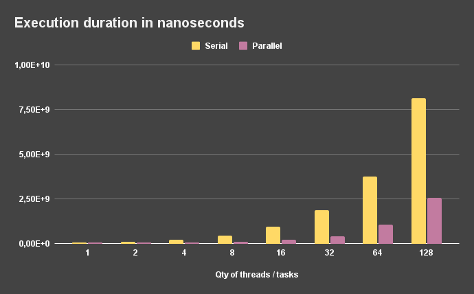
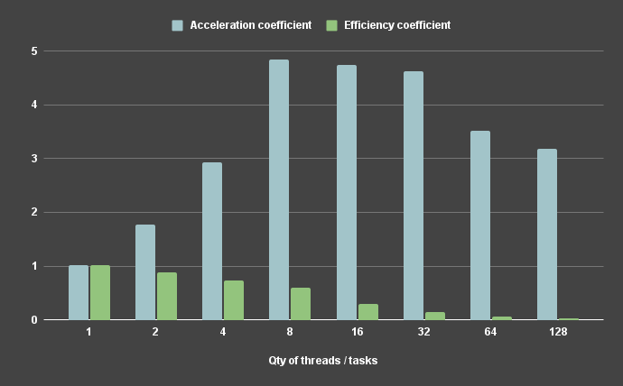
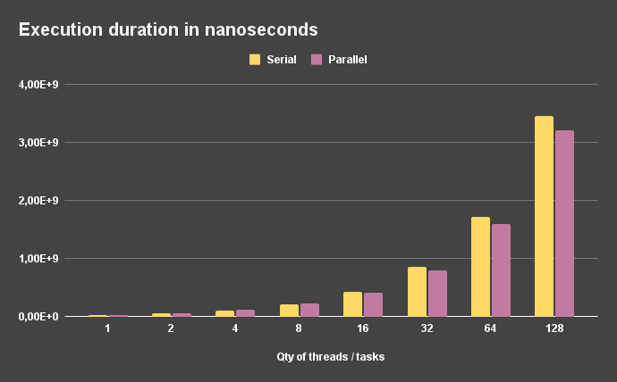
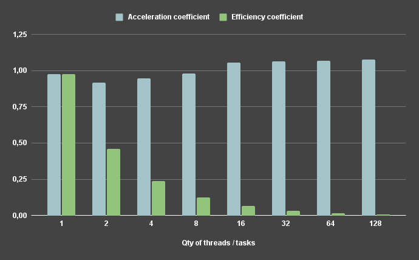

# Methods and technologies of parallel programming

Repository with laboratory works on the subject "Methods and technologies of parallel programming"
___

## [LAB-01] - Tools for creating and managing threads in parallel multithreaded programs

**Task:**
Implement sequential and parallel multithreaded processing of independent tasks (for example, parameter sweep -
instances of one task for different parameter values are solved). Implement examples of three types of tasks:

1. **CPU-bound** - complex calculations with a small amount of data;
2. **Memory-bound** - work with data stored in memory;
3. **IO-bound** - work with data on disk.
   
Measure the dependence of execution time on the number of threads.

### Results

___

###### CPU-bound:

As an example of a CPU-bound problem,
the [Leibniz convergent series](https://en.wikipedia.org/wiki/Leibniz_formula_for_%CF%80) method for calculating the Pi
number was implemented. During the testing 4-core 8-threads processor was used.

Result table ([raw data](./results/lab01/cpu-bound/results.csv)):

| Qty of threads / tasks | Serial duration (ns) | Parallel duration (ns) | Acceleration coefficient | Efficiency coefficient |
| :--------------------: | :------------------: | :--------------------: | :----------------------: | :-------------------:  |
| 1                      | 73836696             | 54741797               | 1.348817541              | 1.348817541            |
| 2                      | 104923688            | 54139244               | 1.93803386               | 0.9690169298           |
| 4                      | 208360282            | 65962089               | 3.158788406              | 0.7896971016           |
| 8                      | 415474386            | 92813951               | 4.476421718              | 0.5595527148           |
| 16                     | 829011850            | 196441276              | 4.220151013              | 0.2637594383           |
| 32                     | 1659078038           | 390972170              | 4.243468373              | 0.1326083866           |
| 64                     | 3345193375           | 1135259744             | 2.946632603              | 0.04604113443          |
| 128                    | 6789882610           | 2271873787             | 2.988670695              | 0.0233489898           |

**Visualization of data:**

---

###### Memory-bound:

As an example of a Memory-bound problem, simple array allocation task was used.
During the test execution, the allocation of an array for 400 megabytes was an independent task.
The total amount of RAM during the test is 32 gigabytes.

Result table ([raw data](./results/lab01/memory-bound/results.csv)):

| Qty of threads / tasks | Serial duration (ns) | Parallel duration (ns) | Acceleration coefficient | Efficiency coefficient |
| :--------------------: | :------------------: | :--------------------: | :----------------------: | :-------------------:  |
| 1                      | 76867829             | 35395877               | 2.171660529840806        | 2.171660529840806      |
| 2                      | 60614411             | 61951231               | 0.9784214134502025       | 0.48921070672510125    |
| 4                      | 85688693             | 93450595               | 0.9169411173893542       | 0.22923527934733856    |
| 8                      | 171685239            | 130514364              | 1.3154509108284818       | 0.16443136385356022    |
| 16                     | 319635077            | 246001529              | 1.2993215054366594       | 0.08120759408979121    |
| 32                     | 628619495            | 487537855              | 1.2893757654982503       | 0.04029299267182032    |
| 64                     | 1597055672           | 1074198679             | 1.4867414224403455       | 0.023230334725630398   |
| 128                    | 3140347240           | 2066281329             | 1.519806231574384        | 0.011873486184174876   |

**Visualization of data:**

