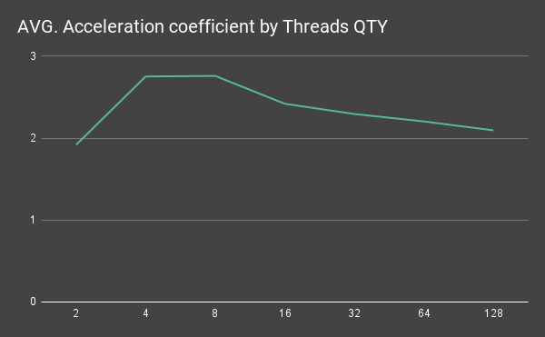
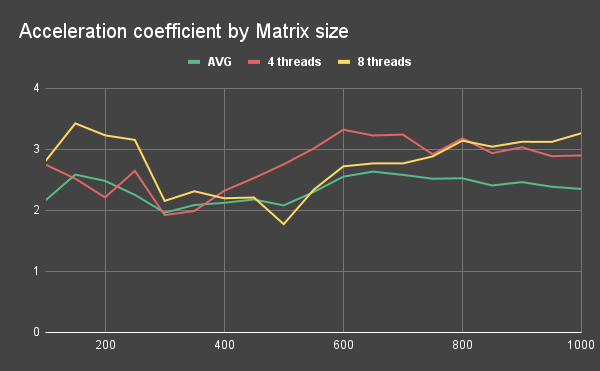

# Methods and technologies of parallel programming

Repository with laboratory works on the subject "Methods and technologies of parallel programming"
___

## [LAB-01] - Tools for creating and managing threads in parallel multithreaded programs

**Task:**
Implement sequential and parallel multithreaded processing of independent tasks (for example, parameter sweep -
instances of one task for different parameter values are solved). Implement examples of three types of tasks:

1. **CPU-bound** - complex calculations with a small amount of data;
2. **Memory-bound** - work with data stored in memory;
3. **IO-bound** - work with data on disk.
   
Measure the dependence of execution time on the number of threads.

#### Detailed results: [CPU-bound](./results/lab01/cpu-bound/results.md) | [Memory-bound](./results/lab01/memory-bound/results.md) | [IO-bound](./results/lab01/io-bound/results.md)

### Conclusion:
From the results of the research we can conclude that the performance result of parallel execution of independent tasks
can differ significantly depending on the type of these tasks. For example, tasks, that involve a large amount of computation
and a small amount of data, can be accelerated very well using parallel programming methods. On the other hand,
tasks involving the use of external shared resources (RAM or I/O devices) may not be accelerated by this approach
(they can even be slowed down by overhead). Thus, the method of parallelization of independent tasks is a powerful tool,
but its use always involves a detailed analysis of the tasks to be performed.
Confirmation of this can also be seen in the charts of the dependence of the acceleration and efficiency coefficients
for different types of tasks depending on the number of threads.

___

## [LAB-02] - Means of interaction and synchronization of threads in parallel multithreaded programs

**Task:**
Implement following task using multi-threaded programming tools. Two matrices (not necessarily square) of a given (numerical) type are specified.
Multiply these matrices, then find the minimum element of the resulting matrix (according to a given comparison criterion),
return its value and indices in the matrix.

Measure the dependence of execution time on the number of threads and the amount of input data.

#### Detailed results: [link](./results/lab02/results.md)

### Conclusion:
In scope of this laboratory work serial and parallel strategies for multiplication and finding the minimal element were created.
Research has shown that program execution time is significantly reduced depending on the number of threads used. 
At the same time, no significant effect of the size of the input data on the acceleration factor was found 
(except for slightly better results on small volumes, which is most likely due to the possibility of efficient use of CPU cache).
Confirmation of this can also be seen in the charts of the dependence of the average acceleration coefficients
depending on the number of threads and matrix size.

