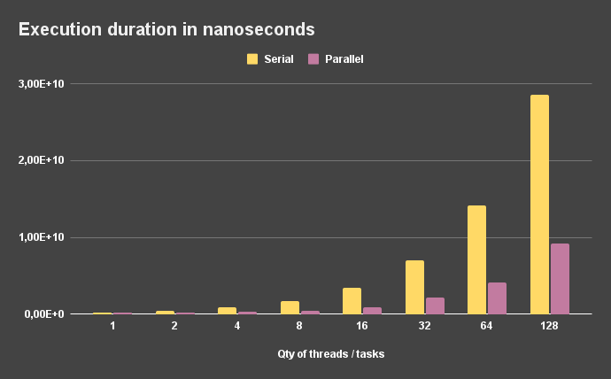
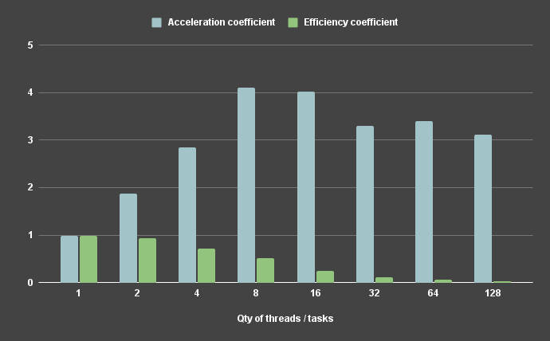

[Argon2](https://argon2-cffi.readthedocs.io/en/stable/argon2.html) is a key derivation function that was selected as the winner of the Password Hashing Competition in July 2015.
One of the key features of this algorithm is the ability to configure the required amount of RAM to calculate a single hash value.
During the execution of tests this parameter was set to 200 MB.

Based on the results, we can conclude that despite the consumption of large amounts of RAM, this algorithm behaves **similarly as a CPU-bound task**.

Result table ([raw data](results.csv)):

| Qty of threads / tasks | Serial duration (ns) | Serial duration      | Parallel duration (ns) | Parallel duration      | Acceleration coefficient | Efficiency coefficient |
| :--------------------: | :------------------: | :------------------: | :--------------------: | :--------------------: | :----------------------: | :-------------------:  |
| 1                      | 217527070            | 0s 217ms             | 220396450              | 0s 220ms               | 0,987                    | 0,987                  |
| 2                      | 433004771            | 0s 433ms             | 231911514              | 0s 231ms               | 1,867                    | 0,934                  |
| 4                      | 860800287            | 0s 860ms             | 303269135              | 0s 303ms               | 2,838                    | 0,71                   |
| 8                      | 1702242454           | 1s 702ms             | 414296047              | 0s 414ms               | 4,109                    | 0,514                  |
| 16                     | 3434166536           | 3s 434ms             | 852741826              | 0s 852ms               | 4,027                    | 0,252                  |
| 32                     | 6970905455           | 6s 970ms             | 2109214214             | 2s 109ms               | 3,305                    | 0,103                  |
| 64                     | 14119008414          | 14s 119ms            | 4157073373             | 4s 157ms               | 3,396                    | 0,053                  |
| 128                    | 28620914115          | 28s 620ms            | 9194700713             | 9s 194ms               | 3,113                    | 0,024                  |

**Visualization of data:**

