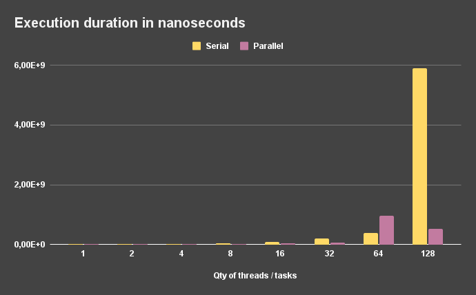
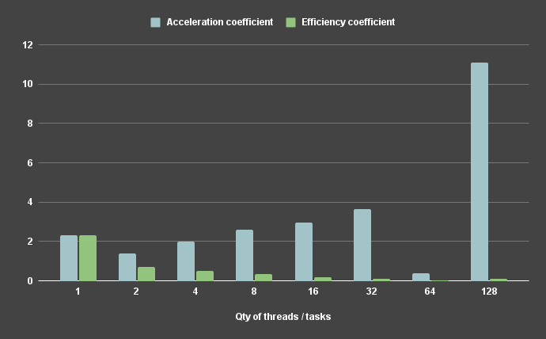
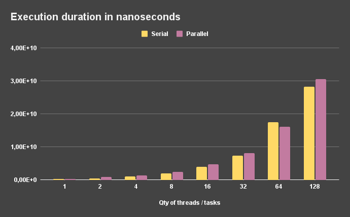
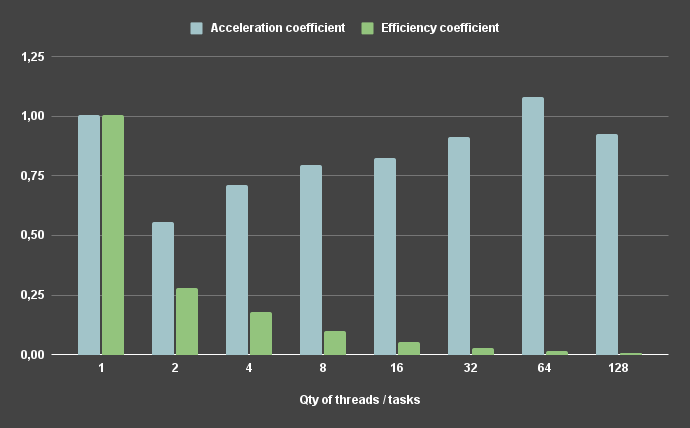

As an example of a IO-bound problem, two types of tasks were used:
- File copying task (disk bounded)
- File downloading task (network bounded)
---
### Copying
During the test execution, the copying of a [file](../../../input/E.coli) (4.6 MB) was an independent task.
From the results we can see inconsistent behavior, which mostly maybe caused by **multilevel caching** of physical drive.
In general results are similar to memory-bound task, what actually confirms existence of cache. Also, at some point of time
we can see significant increase of execution time, which maybe caused by cache flush.

Result table ([raw data](./disk/results.csv)):

| Qty of threads / tasks | Serial duration (ns) | Serial duration      | Parallel duration (ns) | Parallel duration      | Acceleration coefficient | Efficiency coefficient |
| :--------------------: | :------------------: | :------------------: | :--------------------: | :--------------------: | :----------------------: | :-------------------:  |
| 1                      | 8820160              | 0s 8ms               | 3778445                | 0s 3ms                 | 2,334                    | 2,334                  |
| 2                      | 11839248             | 0s 11ms              | 8563471                | 0s 8ms                 | 1,383                    | 0,691                  |
| 4                      | 22362714             | 0s 22ms              | 11294580               | 0s 11ms                | 1,98                     | 0,495                  |
| 8                      | 42865481             | 0s 42ms              | 16366399               | 0s 16ms                | 2,619                    | 0,327                  |
| 16                     | 89607345             | 0s 89ms              | 30262967               | 0s 30ms                | 2,961                    | 0,185                  |
| 32                     | 210102533            | 0s 210ms             | 57854906               | 0s 57ms                | 3,632                    | 0,113                  |
| 64                     | 379050756            | 0s 379ms             | 970241961              | 0s 970ms               | 0,391                    | 0,006                  |
| 128                    | 5906258239           | 5s 906ms             | 532157344              | 0s 532ms               | 11,099                   | 0,087                  |

##### Visualization of data:

---

### Downloading
During the test execution, the downloading of a [file](../../../input/E.coli) (4.6 MB) from web-server hosted on
a separate device in local network was an independent task.

Result table ([raw data](./network/results.csv)):

| Qty of threads / tasks | Serial duration (ns) | Serial duration      | Parallel duration (ns) | Parallel duration      | Acceleration coefficient | Efficiency coefficient |
| :--------------------: | :------------------: | :------------------: | :--------------------: | :--------------------: | :----------------------: | :-------------------:  |
| 1                      | 245458361            | 0s 245ms             | 244662296              | 0s 244ms               | 1,003                    | 1,003                  |
| 2                      | 457698130            | 0s 457ms             | 822761524              | 0s 822ms               | 0,556                    | 0,278                  |
| 4                      | 972867880            | 0s 972ms             | 1368024951             | 1s 368ms               | 0,711                    | 0,178                  |
| 8                      | 1948343930           | 1s 948ms             | 2444896548             | 2s 444ms               | 0,797                    | 0,1                    |
| 16                     | 3894720826           | 3s 894ms             | 4731598598             | 4s 731ms               | 0,823                    | 0,051                  |
| 32                     | 7371755516           | 7s 371ms             | 8078399098             | 8s 78ms                | 0,913                    | 0,029                  |
| 64                     | 17426096696          | 17s 426ms            | 16144845963            | 16s 144ms              | 1,079                    | 0,017                  |
| 128                    | 28349442932          | 28s 349ms            | 30647468707            | 30s 647ms              | 0,925                    | 0,007                  |

##### Visualization of data:

