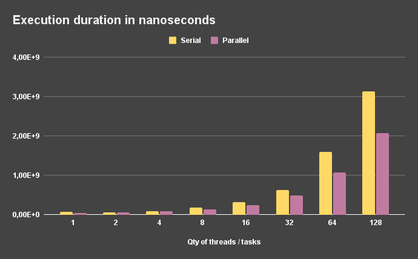
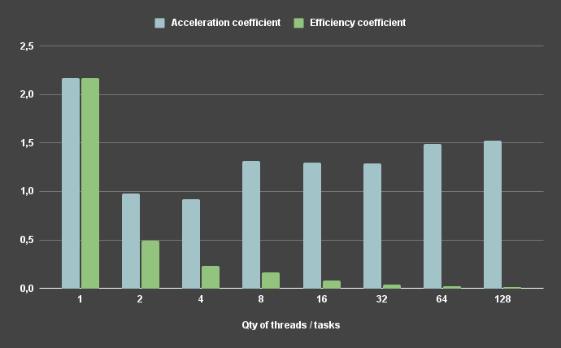

As an example of a Memory-bound problem, simple array allocation task was used.
During the test execution, the allocation of an array for 400 megabytes was an independent task.
The total amount of RAM during the test is 32 gigabytes. Also in scope of this task Argon2 hashing algorithm was analyzed - [results](../hashing/results.md).

Result table ([raw data](results.csv)):

| Qty of threads / tasks | Serial duration (ns) | Serial duration      | Parallel duration (ns) | Parallel duration      | Acceleration coefficient | Efficiency coefficient |
| :--------------------: | :------------------: | :------------------: | :--------------------: | :--------------------: | :----------------------: | :-------------------:  |
| 1                      | 26453114             | 0s 26ms              | 27060103               | 0s 27ms                | 0,978                    | 0,978                  |
| 2                      | 53021481             | 0s 53ms              | 57724205               | 0s 57ms                | 0,919                    | 0,459                  |
| 4                      | 108307683            | 0s 108ms             | 114465481              | 0s 114ms               | 0,946                    | 0,237                  |
| 8                      | 215028967            | 0s 215ms             | 219282738              | 0s 219ms               | 0,981                    | 0,123                  |
| 16                     | 427000166            | 0s 427ms             | 404614689              | 0s 404ms               | 1,055                    | 0,066                  |
| 32                     | 853769430            | 0s 853ms             | 801830367              | 0s 801ms               | 1,065                    | 0,033                  |
| 64                     | 1712116929           | 1s 712ms             | 1603051683             | 1s 603ms               | 1,068                    | 0,017                  |
| 128                    | 3457972741           | 3s 457ms             | 3209740777             | 3s 209ms               | 1,077                    | 0,008                  |

**Visualization of data:**

