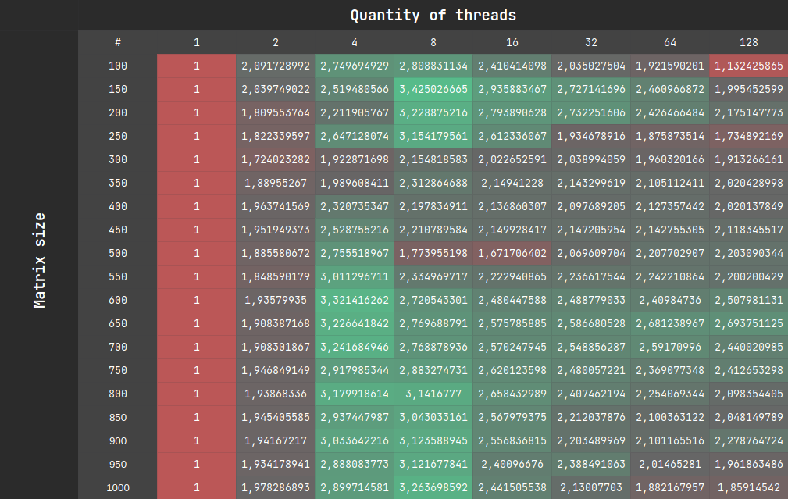

To accomplish this task, the following strategies were implemented:
 - [Serial matrix multiplication](../../src/main/java/edu/kpi/lab02/strategy/serial/SerialMatrixMultiplicationStrategy.java)
 - [Parallel matrix multiplication](../../src/main/java/edu/kpi/lab02/strategy/parallel/ParallelMatrixMultiplicationStrategy.java)
 - [Serial minimal element search](../../src/main/java/edu/kpi/lab02/strategy/serial/SerialMinimalElementSearchStrategy.java)
 - [Parallel minimal element search](../../src/main/java/edu/kpi/lab02/strategy/parallel/ParallelMinimalElementSearchStrategy.java)

Then usage of these strategies was combined in single [AnalyzationStrategy](../../src/main/java/edu/kpi/lab02/strategy/analyzation/AnalyzationStrategy.java) for further experiments, measurement and testing.
During the main test following input values were used:
 - **threads quantity**: from 1 to 128;
 - **matrix size**: from 100 to 1000 with a step of 50.

Result table (**matrix size** as a row parameter, **thread quantity** as a column parameter, value represented in **seconds**) ([raw data](results.csv)):

|  #       |  1      |  2      |  4      |  8      |  16     |  32     |  64     |  128    |
| :-----:  | :-----: | :-----: | :-----: | :-----: | :-----: | :-----: | :-----: | :-----: |
| **100**  | 0,0188  | 0,009   | 0,0069  | 0,0067  | 0,0078  | 0,0093  | 0,0098  | 0,0166  |
| **150**  | 0,0614  | 0,0301  | 0,0244  | 0,0179  | 0,0209  | 0,0225  | 0,025   | 0,0308  |
| **200**  | 0,1342  | 0,0742  | 0,0607  | 0,0416  | 0,048   | 0,0491  | 0,0553  | 0,0617  |
| **250**  | 0,2682  | 0,1472  | 0,1013  | 0,085   | 0,1027  | 0,1386  | 0,143   | 0,1546  |
| **300**  | 0,4859  | 0,2818  | 0,2527  | 0,2255  | 0,2402  | 0,2383  | 0,2479  | 0,254   |
| **350**  | 0,8245  | 0,4363  | 0,4144  | 0,3565  | 0,3836  | 0,3847  | 0,3916  | 0,4081  |
| **400**  | 1,2695  | 0,6465  | 0,547   | 0,5776  | 0,5941  | 0,6052  | 0,5968  | 0,6284  |
| **450**  | 1,9177  | 0,9825  | 0,7584  | 0,8674  | 0,892   | 0,8931  | 0,895   | 0,9053  |
| **500**  | 2,8363  | 1,5042  | 1,0293  | 1,5989  | 1,6967  | 1,3705  | 1,2847  | 1,2874  |
| **550**  | 4,066   | 2,1995  | 1,3503  | 1,7414  | 1,8291  | 1,8179  | 1,8134  | 1,848   |
| **600**  | 6,2766  | 3,2424  | 1,8897  | 2,3071  | 2,5304  | 2,5219  | 2,6045  | 2,5026  |
| **650**  | 8,9336  | 4,6812  | 2,7687  | 3,2255  | 3,4683  | 3,4537  | 3,3319  | 3,3164  |
| **700**  | 11,9367 | 6,2551  | 3,6823  | 4,311   | 4,6442  | 4,6832  | 4,6057  | 4,892   |
| **750**  | 15,6394 | 8,0332  | 5,3596  | 5,4242  | 5,9689  | 6,3061  | 6,6015  | 6,4822  |
| **800**  | 19,3947 | 10,0041 | 6,0991  | 6,1734  | 7,2955  | 8,0561  | 8,6043  | 9,2428  |
| **850**  | 23,7233 | 12,1945 | 8,0762  | 7,7959  | 9,2381  | 10,7246 | 11,2949 | 11,5828 |
| **900**  | 29,1184 | 14,9966 | 9,5985  | 9,3221  | 11,3885 | 13,2147 | 13,8582 | 12,7782 |
| **950**  | 35,0685 | 18,131  | 12,1425 | 11,2339 | 14,606  | 14,6823 | 17,4067 | 17,8751 |
| **1000** | 40,694  | 20,5703 | 14,0338 | 12,4687 | 16,6676 | 19,1045 | 21,6208 | 21,8886 |
 
Also, these data were processed and the following table was obtained:

In the cells of this table are appropriate acceleration coefficients for each input parameters set.
Then conditional formatting was applied to visualize the data.
From this table we see that the most efficient execution of the task in a multithreaded environment
occurs at the number of threads equal to 4 or 8, regardless the size of the input data.
Such a behavior is in line with expectations, as the test environment is equipped with a 4-core 8-threads processor.