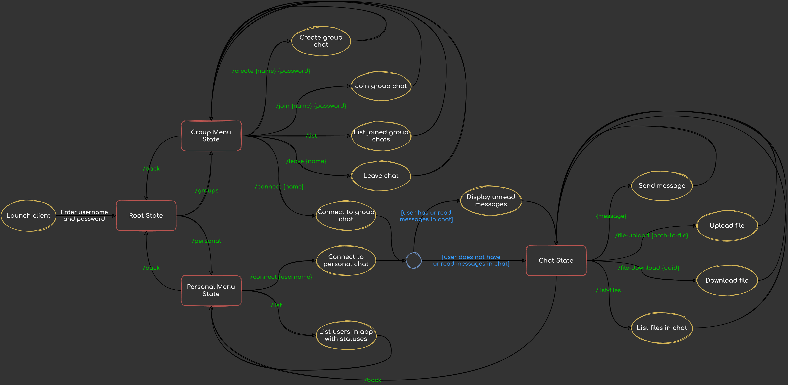

To accomplish this task two separate Java applications were created: [server](../../src/main/java/edu/kpi/lab05/server/Main.java) and [client](../../src/main/java/edu/kpi/lab05/client/Main.java).
Server is a main part of messaging system, which is listening for socket connections to serve.
The client is used by the user to connect to the server and interact with the system using CLI.

Implemented messaging system has following list of features:
- Send text messages
- File transfer
- Transmission of individual messages
- Groups of participants, sending messages to all members of this group
- List of participants
- Tracking of participants who have disconnected due to network problems
- Ability to send messages to participants who are currently offline

### High-level state diagram of the system

Legend:
- yellow - **action**
- red - **state**
- green - **CLI command**
- blue - **conditional statement**
- black - **transition**